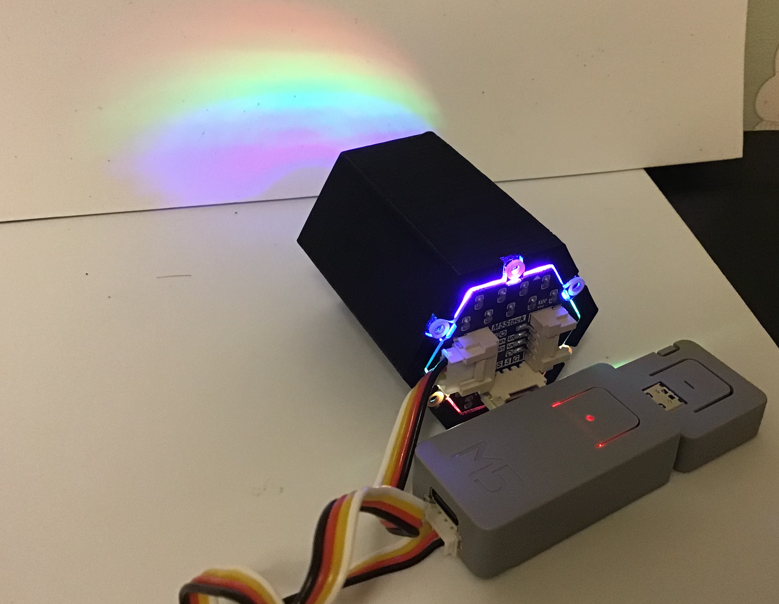
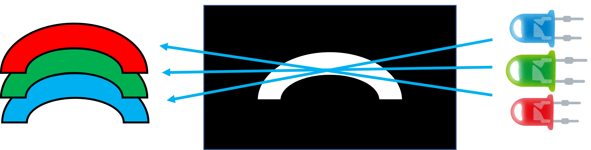
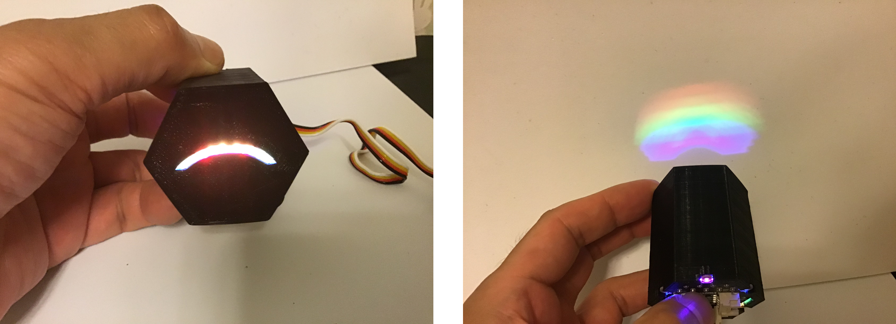
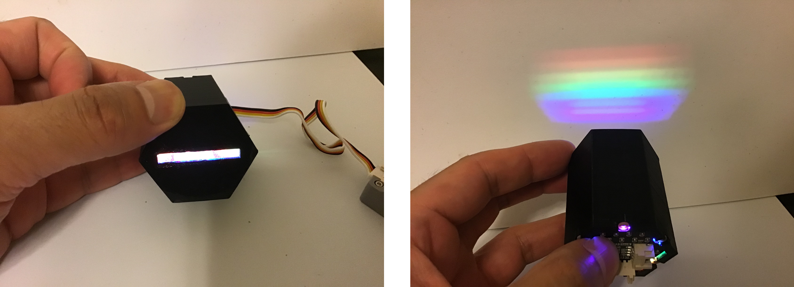
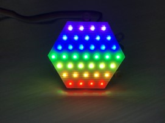

# Rainbow Light
M5Stackの[Neo HEX 37 RGB LED Board](https://docs.m5stack.com/en/unit/neohex )を使った虹ライト。

---

### 仕組み ###
スリットを通すことで光が直進し、虹の形を映し出すことができます。

---

### アーチ型 ###

---

### ストレート型 ###

---

### ソフト ###
HEX 37 RGB LED Board を１列ごとに虹色に点灯させます。

### ソフト環境 ###
* Arduino IDE (バージョン 1.8.13で動作確認をしました。) 
* [FastLED](https://github.com/FastLED/FastLED)ライブラリ(バージョン 3.4で動作確認をしました。) 

---

### Link ###
[PikaPikaLight Blog](https://pikapikalight.hatenadiary.com/entry/2021/04/07/080000)